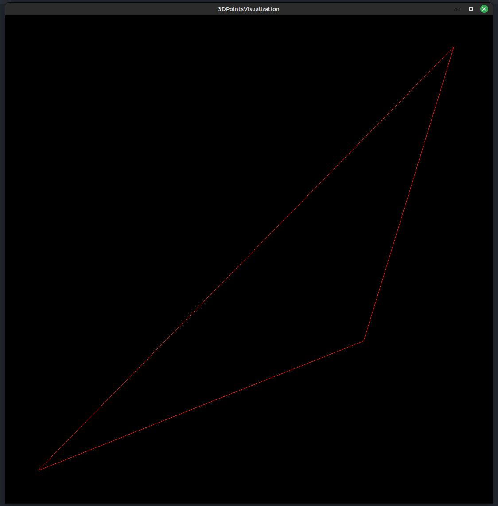
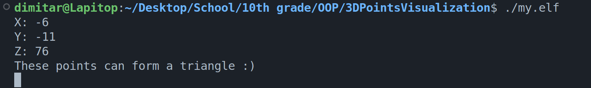

# 3D Points Visualization and Checking

This is a program that checks if 3 points can form a triangle in the 3D space and visualize them using OpenGL.

## Requirements

You must have OpenGL and g++ working on your computer

## Usage

```bash
g++ main.cpp -o my.elf -std=c++11 -Wall -lGL -lGLU -lglut -lGLEW -lglfw -lX11 -lXxf86vm -lXrandr -lpthread -lXi -ldl -lXinerama -lXcursor
```

```bash
./my.elf
```

## Input Points

```
(-5,-5,0)
(4,-3,1)
(2,5,2)
```

## Output





## Contributing

Pull requests are welcome. For major changes, please open an issue first
to discuss what you would like to change.
